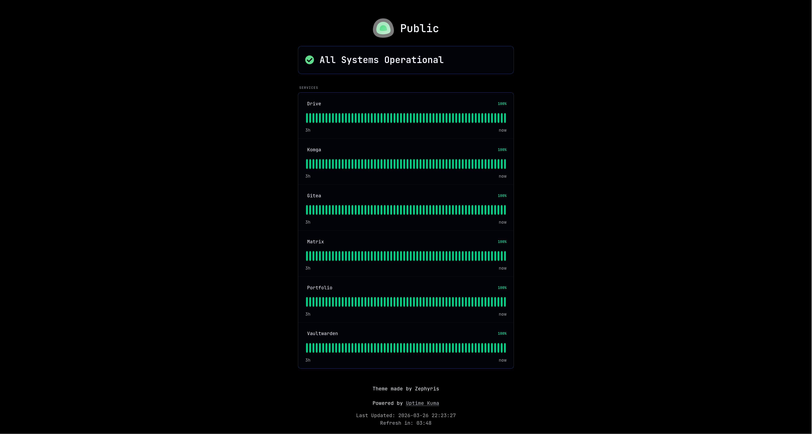

<h3 align="center">Onyx-Kuma</h3>
<p align="center">
  Give your <a href="https://github.com/louislam/uptime-kuma">Uptime Kuma</a> status page a sleek dark and terminal-inspired look with Onyx-Kuma
  <br>
  <a href="#"><strong>Live demo »</strong></a>
  <br>
  <br>
  <a href="#features">Features</a>
  ·
  <a href="#installation">Installation</a>
  ·
  <a href="#personalization">Personalization</a>
</p>
<p align="center">
  
</p>

## Features

- Deep dark background with a terminal-inspired aesthetic
- Monospace typography for a clean techy feel
- Cyan/green accent color for status indicators and uptime bars
- Minimal UI - no visual clutter, just the essentials
- Transparent alert cards with colored accent border
- Support for Uptime Kuma v2.2.x
- Clean, easily customizable and extendable code

## Installation

1. In your Uptime Kuma dashboard, navigate to your status page.
2. Click `Edit Status Page`.
3. Scroll down to the `Custom CSS` field.
4. Copy the contents of `main.css` and paste it into the `Custom CSS` field.
5. Click `Save` at the bottom.

## Personalization

You can easily customize the theme by modifying the variables inside the `:root {}` block.

### Accent color

The default accent is a cyan-green (`#00e5a0`). To change it, update `--bs-primary` in the `:root {}` block:
```css
:root {
  --bs-primary: #04d186; /* Change this to your preferred color */
}
```
